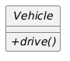
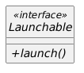

Exam #2 Practice - Generics
===========================

Baseline
--------

In directory E1/practice-generic/baseline, class ``Top3`` accepts integers via the ``add(Integer x)`` method.

``Top3`` uses fields ``first``, ``second``, and ``third`` to retain the 3 largest integers added, using the ``compareTo`` method. These may be accessed using the ``getFirst()``, ``getSecond()``, and ``getThird()`` getter methods.

The ``main`` method asks the user to enter integers, which it adds to a ``Top3`` instance. After each integer is entered, it outputs the top 3 values entered thus far. For example:

.. code::

 Enter any integer (Ctrl-C to exit): 17
 Top 3 are: 17
 Enter any integer (Ctrl-C to exit): 42
 Top 3 are: 42 17
 Enter any integer (Ctrl-C to exit): 11
 Top 3 are: 42 17 11
 Enter any integer (Ctrl-C to exit): 91
 Top 3 are: 91 42 17
 Enter any integer (Ctrl-C to exit): -3
 Top 3 are: 91 42 17
 Enter any integer (Ctrl-C to exit): 

Also in the baseline directory is the class ``Triple``, similar to a 3D vector including methods for ``magnitude``, ``compareTo``, ``equals``, ``hashCode``, and ``toString``.

Assignment
----------

Make class ``Top3`` generic, so that it will work with any suitable class, not just ``Integer``.

Once modified, update method ``main`` to use the new generic version of ``Top3`` to retain the top 3 largest ``Integer`` objects.

Finally, modify ``main`` to use the generic version of ``Top3`` to instead retain the top 3 largest ``Triple`` objects. Output may look like this:

.. code::

 Enter any 3 integers (Ctrl-C to exit): 1 2 3
 Top 3 are: (1,2,3)
 Enter any 3 integers (Ctrl-C to exit): 2 3 4
 Top 3 are: (2,3,4) (1,2,3)
 Enter any 3 integers (Ctrl-C to exit): -3 -4 -5
 Top 3 are: (-3,-4,-5) (2,3,4) (1,2,3)
 Enter any 3 integers (Ctrl-C to exit): 12 0 0
 Top 3 are: (12,0,0) (-3,-4,-5) (2,3,4)
 Enter any 3 integers (Ctrl-C to exit): 9 0 0
 Top 3 are: (12,0,0) (9,0,0) (-3,-4,-5)
 Enter any 3 integers (Ctrl-C to exit): 

Suggested Solution
------------------

The suggested solution is in the cse1325-prof/exam2/practice/generic/suggested-solution subdirectory.

.. raw:: pdf

    PageBreak

Exam #2 Practice - File I/O and Map
===================================

File ev-sales.dat alternates the name of each US state (and the District of Columbia) with the number of Electric Vehicles (EVs) sold in that state in 2022.

Write a main method that does the following:

1. Create a ``HashMap`` using the state name (a String) as the key and the number of EVs sold (an int) as the value.
2. Using try-with-resources, open file ev-sales.dat for input.
3. Read each state and its sales figure from the file.

   a. Add each to the ``HashMap``.
   b. Keep a running total of sales in all states.
   
4. If an error occurs, print an error message to the error channel, print a stack trace, and then exit with code -1.
5. Using try-with-resources, open file ev-percentages.dat for output.
6. Iterate over your ``HashMap``. 

   a. For each state, calculate the percentage of its sales compared to the entire US. For example, if Alabama sold 8,730 EVs and 2,442,270 EVs were sold across the US, the percentage is 6220 / 2442270 or 0.36%.
   b. Write the state, the sales figure, and then the percentage to the file on separate lines.
   c. Print the data to the console. For example, for Alabama print "Alabama bought   8730 EVs or  0.4%".
   
7. If an error occurs, print an error message to the error channel, print a stack trace, and then exit with code -2.
8. Print the total number of EVs bought in the US in 2022. For example, "Total EVs  bought  were  2442270".

Suggested Solution
------------------

The suggested solution is in the cse1325-prof/exam2/practice/jcs-files/suggested-solution subdirectory.

.. raw:: pdf

    PageBreak
    
Exam #2 Practice - Interfaces
=============================

Part 1
------

Consider the following abstract class ``Vehicle``. 

* Redraw the class diagram to represent the same specification as interface ``Driveable``. 
* Write Java interface ``Driveable`` in file Driveable.java.
* Finally, rewrite ``Toyota`` in Toyota.java to implement interface ``Driveable`` rather than extend class ``Vehicle``.

.. code:: Java

 public class Toyota extends Vehicle {
    @Override
    public void drive() {
        System.out.println("Driving my Toyota on down the road!");
    }
    public static void main(String[] args) {
        Toyota toyota = new Toyota();
        toyota.drive();
    }
 }

Part 2
------
   
Consider the following interface specification ``Launchable``. In as few words as possible, write Java interface ``Launchable`` in file Launchable.java.

Suggested Solution
------------------

The suggested solutions are in the cse1325-prof/exam2/practice/interface/suggested-solution subdirectory.

